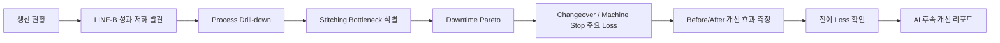
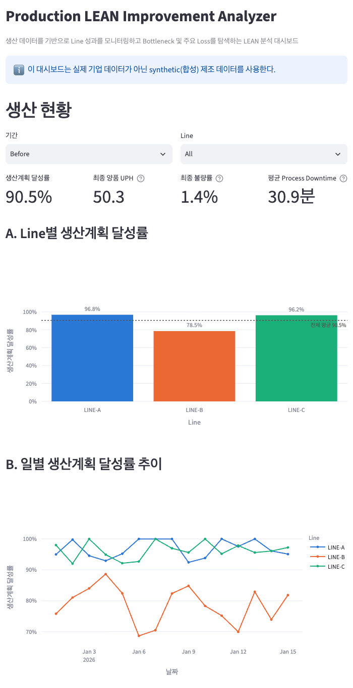
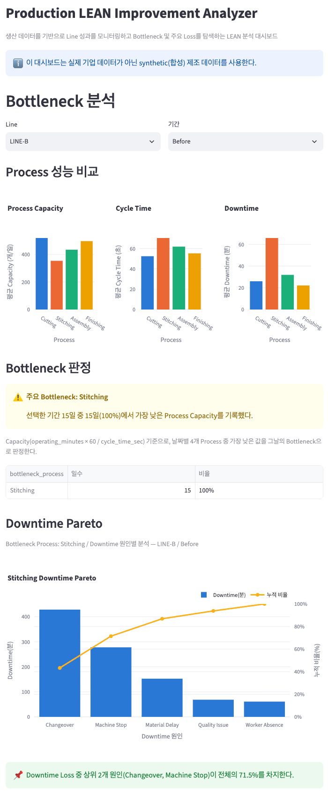
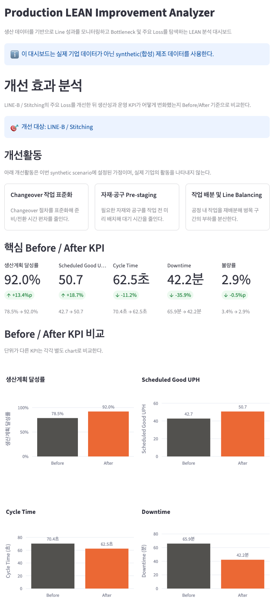
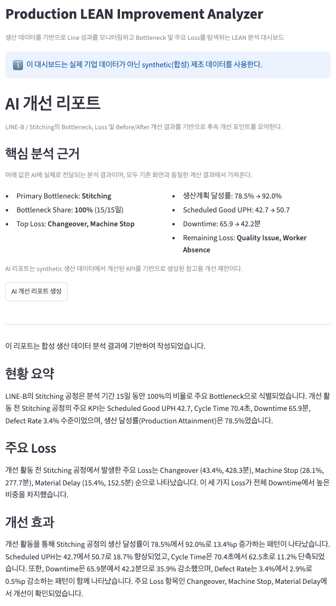

# Production LEAN Improvement Analyzer

생산 데이터를 기반으로 Line 성과를 모니터링하고 Bottleneck과 주요 Loss를 식별한 뒤, Before/After
개선 효과와 후속 개선 우선순위까지 분석하는 LEAN 생산 분석 프로젝트이다.

## 프로젝트 한눈에 보기

- **문제**: 생산 Line 성과 저하의 원인과 Bottleneck을 빠르게 파악하기 어려움
- **분석 흐름**: 생산 현황 → Line 비교 → Process Drill-down → Bottleneck → Downtime Pareto
  → Before/After 개선 효과 → AI 후속 개선 리포트
- **핵심 결과**: LINE-B / Stitching이 주요 Bottleneck으로 식별됨 (Before 15일 중 15일, 100%)
- **주요 Loss**: Changeover(43.4%), Machine Stop(28.1%) — 상위 2개가 전체 Downtime의 71.5%
- **개선 효과**: 생산계획 달성률 78.5% → 92.0%(+13.4%p), Scheduled Good UPH +18.7%
- **AI 활용**: Python이 계산한 분석 결과를 구조화해 Gemini에 전달하고, 후속 개선 우선순위를 생성

## 프로젝트 배경

제조 현장에서는 생산량 자체보다, 어느 Line·Process가 전체 생산성을 제한하는 Bottleneck인지 파악하는
것이 더 중요하다. 이 프로젝트는 단순 KPI 모니터링에서 끝나지 않고 Bottleneck 식별 → Loss 원인 분석
→ 개선활동 → 효과 측정으로 이어지는 분석 흐름을 구현했다.

실제 기업 생산 데이터에 접근할 수 없어, 신발 제조 공정을 가정한 synthetic dataset을 직접 설계했다.
**실제 기업의 생산 데이터가 아니다.**

## 분석 시나리오

- Line: LINE-A / LINE-B / LINE-C
- Process: Cutting → Stitching → Assembly → Finishing
- 기간: 30일 (Day 1~15 Before / Day 16 Improvement / Day 17~30 After)
- 핵심 문제: **LINE-B / Stitching**이 개선 전 주요 Bottleneck
- Day 16 개선활동: Changeover 작업 표준화, 자재·공구 Pre-staging, 작업 배분 및 Line Balancing

Line throughput은 4개 Process capacity 중 가장 낮은 값에 의해 제한되는 단순화된 steady-state
synthetic model이다.

## 분석 흐름



## 핵심 분석 결과

### Bottleneck

Before 기간 LINE-B 기준:

- Primary Bottleneck: **Stitching** — 15일 중 15일(100%)에서 가장 낮은 Process Capacity
- Cycle Time: 약 70.4초 (다른 Process 평균 대비 높음)
- 평균 Downtime: 약 65.9분

### Downtime Pareto

LINE-B / Stitching / Before 기준:

| Reason | 비중 |
| --- | ---: |
| Changeover | 43.4% |
| Machine Stop | 28.1% |
| Material Delay | 15.4% |
| Quality Issue | 6.9% |
| Worker Absence | 6.2% |

상위 2개 Loss(Changeover + Machine Stop)가 전체 Downtime의 약 71.5%를 차지한다.

## 개선 효과

LINE-B / Stitching의 Before(Day 1~15) vs After(Day 17~30) 비교:

| KPI | Before | After | 변화 |
| --- | ---: | ---: | ---: |
| 생산계획 달성률 | 78.5% | 92.0% | +13.4%p |
| Scheduled Good UPH | 42.7 | 50.7 | +18.7% |
| Cycle Time | 70.4초 | 62.5초 | -11.2% |
| Downtime | 65.9분 | 42.2분 | -35.9% |
| 불량률 | 3.4% | 2.9% | -0.5%p |

- Changeover 일평균 Downtime은 약 71.6% 감소했다.
- 다만 Quality Issue, Worker Absence는 After 기간 일평균 Downtime이 오히려 증가해, 후속 개선
  과제로 확인됐다.

모든 지표가 일괄적으로 개선된 것은 아니며, Before/After 데이터 자체도 일부 겹치는 구간과 현실적인
변동을 포함한다.

## AI 개선 리포트 설계

**LLM은 raw production data를 직접 분석하지 않는다.**

```
production_data.csv → Python KPI/Bottleneck/Pareto/Before-After 계산
→ 구조화된 report context(JSON) → Gemini → 후속 개선 우선순위
```

- 숫자 계산과 Bottleneck 판정은 전부 deterministic한 Python 로직(`src/metrics.py`, `src/analysis.py`)이
  담당한다.
- Gemini에는 이미 검증된 분석 결과(JSON)만 전달되며, raw CSV 전체나 원본 dataframe은 전달되지 않는다.
- 데이터에 없는 원인(설비 상태, 인력 문제 등)을 사실처럼 생성하지 않도록 prompt에서 명시적으로
  제한한다.
- AI는 분석 자체가 아니라 결과 설명과 후속 개선 아이디어 제안 역할을 맡는다.

## 주요 화면

### 1. 생산 현황

전체 Line의 생산계획 달성률과 일별 추이를 비교해 성과가 낮은 Line을 빠르게 확인한다.



### 2. Bottleneck 분석

LINE-B / Before 구간을 Process 단위로 Drill-down하여 Stitching이 주요 Bottleneck임을 확인하고, Downtime Pareto로 주요 Loss를 파악한다.



### 3. 개선 효과 분석

LINE-B / Stitching의 Before/After KPI를 비교해 생산계획 달성률, UPH, Cycle Time, Downtime 등의 변화와 개선 효과를 확인한다.



### 4. AI 개선 리포트

Python에서 계산한 Bottleneck, 주요 Loss, Before/After KPI와 잔여 Loss를 구조화해 Gemini에 전달하고, 후속 개선 과제를 요약한다.



## KPI 정의

- `production_attainment = actual_qty / planned_qty`
- `scheduled_good_uph = good_qty / (8시간 shift)` — shift 전체(downtime 포함) 기준 output 속도
- `runtime_good_uph = good_qty / (operating_minutes / 60)` — 실제 가동시간 기준 output 속도
- `defect_rate = defect_qty / actual_qty`
- `downtime_rate = downtime_minutes / 480`
- `process_capacity = operating_minutes × 60 / cycle_time_sec`

Bottleneck은 같은 date × line의 4개 Process 중 Capacity가 가장 낮은 Process로 정의한다.

`planned_qty` / `actual_qty`는 동일 date × line의 4개 Process row에 반복되므로, Line 단위 KPI를
계산할 때는 먼저 dedup한 뒤 계산해 4배 중복 집계를 방지한다.

## 기술 스택

| 영역 | 기술 |
| --- | --- |
| Data | Python, pandas, NumPy |
| Visualization | Streamlit, Plotly |
| AI Report | Google Gemini (`google-genai`) |
| Environment | conda, Python 3.11 |
| Version Control | Git, GitHub |

## 프로젝트 구조

```text
lean-production-analyzer/
├── app.py
├── requirements.txt
├── .env.example
├── data/
│   └── production_data.csv
├── src/
│   ├── generate_data.py
│   ├── metrics.py
│   ├── analysis.py
│   └── report.py
└── scripts/
    └── validate_data.py
```

## 실행 방법

```bash
conda create -n lean-production-analyzer python=3.11
conda activate lean-production-analyzer
pip install -r requirements.txt
streamlit run app.py
```

AI 개선 리포트를 사용하려면 `.env.example`을 참고해 로컬 `.env`에 `GEMINI_API_KEY`를 설정한다.
API key가 없어도 생산 현황 / Bottleneck 분석 / 개선 효과 분석 화면은 정상 동작한다.

## 데이터 안내 및 한계

- 실제 기업/생산 현장 데이터를 사용하지 않았다.
- 제조 LEAN 분석 흐름을 검증하기 위해 직접 설계한 synthetic dataset이다.
- 상세 WIP, 재작업, 설비 event, 교대조·제품 mix 등 실제 현장의 요소는 모델링하지 않았다.
- 실제 적용 시 MES/설비/품질/인력 데이터와 연결해 확장할 수 있다.
